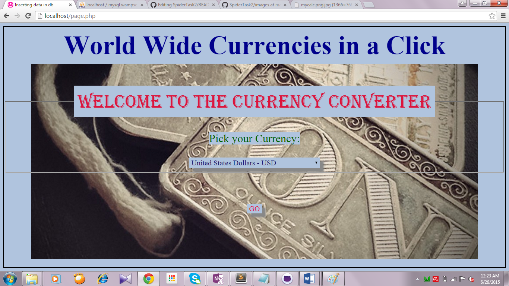
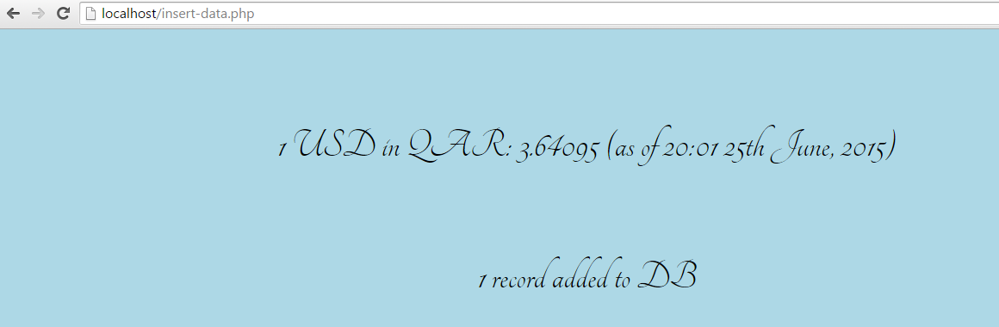
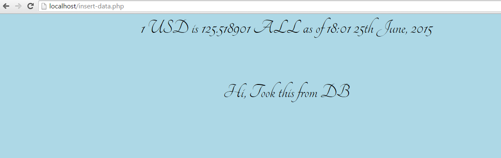
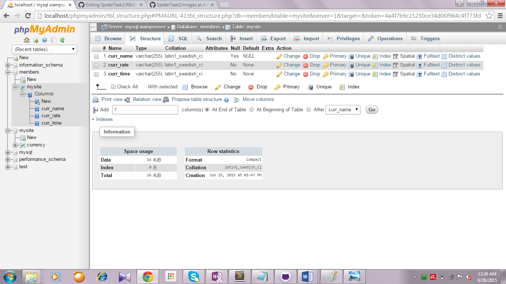

# SpiderTask2
The  server stack I have used is WAMP- MySQL handles the database components, while PHP represents the dynamic scripting languages.

#**My Page for Spider Webdev Inductions- TASK 2!**
---
###Welcome to my humble abode!

This is my page for the Web-dev Inductions held by Spider. 

---
---
Now these are the instructions you need to be able to access my work:
First, what have I made.

I have decided to try out a CURRENCY CONVERTER. That's right, Something you may use to convert to currencies of your choice, feel better about yourself, if low on cash.

Back to point.

---
---

This currency convertor lets you pick a currency from a variety of currencies that are provided to you in a drop-down option.
Once a currency of your choice is picked, it gives you the result.
If already present in DB and less than an hour old, it retrieves data from the DB and shows to you the value along with the message "Hi, Took this from DB".
Else, if more than an hour old, or new, it retrieves the information from the API.

---
---

The API I used for the task is: http://openexchangerates.org/api/{$file}?app_id={$appId}
(Using my acquired App Id)

---
---
Before going into the instructions, one more thing. You would've noticed the excess(probably even unwanted) bunch of php files. I just wanted my learning to be open and well, just out there. 
However, a few of those files are important and are discussed below:
---
1)page.php

Containing within it a CSS link to stylise my page.php, this page merely presents to the audience, the options of currencies available and the GO button to proceed.

2)style.css

Contains a little background color, simple stuff.

3)insert-data.php

If the user clicks GO, insert-data.php is where we're headed.
Here, is where the action occurs, my friend.
It firstly includes mysql-connect.php to connect to the DB.
The entered currency is checked against the DB for a match while simultaneously, also checking for time < 1 hour using timestampadd. 
If yes, data from DB is retrieved and shown in a page that is also stylised quite a bit, with google fonts.
If no, data is taken fresh from API, and inserted in DB.

4)mysql-connect.php

This connects to the DB.

---
---

Alright, HOW DO YOU OBTAIN MY WORK ON YOUR LOCAL SERVER?
###Here are the instructions :

a)The only files in consideration are the ones named
page.php, insert-data.php,mysql-connect.php and style.css. 

b)Download and save these as they are onto your local system , with the same names as given.

c)On a browser of your choice, go to:
 localhost/page.php
 
 
d)Pick a choice of currency.

e)Click GO.

f)There you go, your result.

---
---

###Screenshot of Page look

---
---

###Screenshot WHEN NEW CURRENCY ASKED

---
---

###Screenshot WHEN OLD CURRENCY LESS THAN 1 HOUR OLD IS ASKED

---
---

###Screenshot of table look

---
---

##Thank you so much for taking a look!

